  

  

    
    
  

  

---

## 👨🏻‍💻 About Me

  

📄 More about me

- 🎓 **M.S. in Information Systems** (Data Science) — University of Maryland, Baltimore County
- 🎓 **B.E. in Computer Engineering** — Savitribai Phule Pune University
- ⚙️ Comfortable across **Agile** and **Waterfall**; happiest taking something from a blank repo to production.

---

## ⚙️ Tech Stack

**Languages**  

**Conversational AI & VUI**  

**GenAI & NLP**  

**Web & App**  

**Cloud, Data & Tools**  

---

## 🚀 Featured Projects

> A mix of what I'm building in the open and the conversational-AI systems I've shipped in production.

### 🛣️ [ioniq6-pilot](https://github.com/C4rohan/ioniq6-pilot)
Personal **openpilot** self-driving build for a Hyundai Ioniq 6 running on a comma 3X — driver-assist tuning, lateral/longitudinal control, and real-world testing. `Python`

### 🤝 HealthAssist — *Production*
Bilingual, cloud-native **Dialogflow CX virtual agent** on **Genesys CX** (us-central1/us-east1 redundancy) automating medical billing & records self-service. **Deflects 20–40% of calls, ~85% lower contact-center cost, 24/7 availability.**

### 🩺 Electronic Visit Verification Bot — *Production*
Multilingual caregiver visit verification over **calls + SMS** using **Voximplant & Telnyx** — real-time compliance tracking and streamlined reporting.

### 🤖 GenAI Suite — *Production*
**GPT-4 + Flask** chatbots and data-analysis tools that cut response times and turn large datasets into decision-ready insights.

---

🏆 <b>Where I've Shipped</b> — clients & employers

 

`HCA Healthcare` · `Parallon` · `CereCore` · `Cognizant` · `Verizon` · `University of Maryland Medical Systems` · `Devoted Guardians` · `Prince George's Community College` · `Elara Caring`

🎓 <b>Certifications</b>

 

-  **Google Cloud — Professional Data Engineer**
-  **Microsoft Azure — AI-102: Designing & Implementing an Azure AI Solution**

---

## 📊 GitHub Stats

  
  

  

  

---

  <b>If you want to grab coffee ☕️ and talk conversational AI, GenAI, or self-driving cars — reach out!</b>

